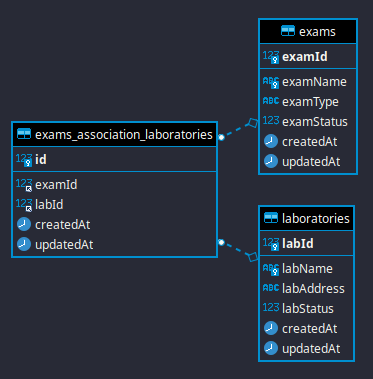

## Descrição

API para manutenção de laboratórios e exames.

## Instalação

1 - Ter docker e docker-compose instalado

2 - Setar as variaveis no .env ou .env.dev. Dependendo ser for em prod ou dev

3 - Acessar container do mysql e rodar as migrações

```bash
# Desenvolvimento
docker exec -ti cl-mysql-dev bash

# Produção
docker exec -ti cl-mysql bash

yarn typeorm migration:run
```

4 - Rodar o script para criação dos containers

```bash
# Desenvolvimento
./scripts/init-docker-dev.sh

# Produção
./scripts/init-docker.sh
```

4 - Para ver a documentação da API basta acessar http://seu-ip:3000/api-docs

## Arquitetura



A API foi separada em dois modulos, laboratory e exam. Cada uma representa uma tabela no banco. No exam está a representação tambem da associação de lab e exam.

## Features

- Typeorm para conexão com o DB
- Joi para validação de dados
- Swagger para documentação de API
- Ambos possuem rotas de CRUD e rotas CUD de lote.
